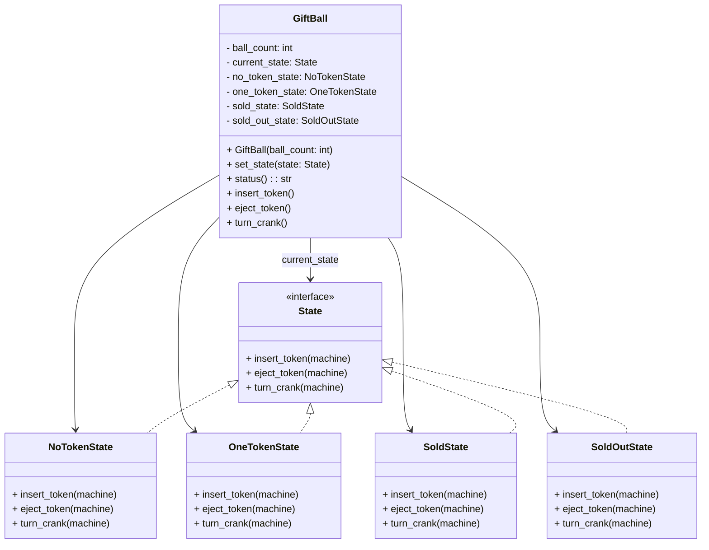

# TP GiftBall

## Objectif

Implémenter en Python une machine à distribuer des balles surprises en respectant une logique d'états et d'actions.

## Version 1 : implémentation simple

### Classe principale

La machine est représentée par une classe unique : `GiftBall`.

### États

Les états sont définis avec une énumération `State` :

- `NO_TOKEN` : pas de jeton
- `ONE_TOKEN` : jeton inséré
- `SOLD` : boule vendue
- `SOLD_OUT` : plus de boules disponibles

### Attributs

- `ball_count` : nombre de boules restantes
- `current_state` : état courant

Le constructeur initialise `current_state` selon le stock :
- si `ball_count > 0` alors `NO_TOKEN`
- sinon `SOLD_OUT`

### Actions

- `insert_token()` : insère un jeton
- `eject_token()` : éjecte le jeton
- `turn_crank()` : tourne la manivelle pour vendre une boule

### Transitions

1. `NO_TOKEN` → `insert_token()` → `ONE_TOKEN`
2. `ONE_TOKEN` → `eject_token()` → `NO_TOKEN`
3. `ONE_TOKEN` → `turn_crank()` → `SOLD`
   - si `ball_count > 0`, retour à `NO_TOKEN`
   - si `ball_count == 0`, passage à `SOLD_OUT`
4. `SOLD_OUT` : plus d'action valide

### Modèle de données

#### MCD

- Entité `GiftBall`
  - `id`
  - `ball_count`
  - `state_id`
- Entité `State`
  - `id`
  - `name`
- Relation : `GiftBall` référence `State`

#### MLD

Table `state`
- `id` INT PRIMARY KEY
- `name` VARCHAR(20)

Table `giftball`
- `id` INT PRIMARY KEY
- `ball_count` INT NOT NULL
- `state_id` INT NOT NULL
- FOREIGN KEY (`state_id`) REFERENCES `state`(`id`)

## Version 2 : State Pattern

Dans `GiftBallV2.py`, la logique a été répartie dans des classes d'état.

### Principes

- `State` est une interface qui définit :
  - `insert_token(machine)`
  - `eject_token(machine)`
  - `turn_crank(machine)`
- Chaque état concret implémente ces actions :
  - `NoTokenState`
  - `OneTokenState`
  - `SoldState`
  - `SoldOutState`
- `GiftBall` contient les instances d'états et délègue les actions à `current_state`.

### Avantages

- meilleure organisation du code
- logique d'état isolée dans des classes séparées
- transitions gérées par les états eux-mêmes

### Diagramme de classes

## Conclusion

Le TP présente deux versions :

- Version 1 : une machine à états simple avec `Enum`
- Version 2 : une architecture State Pattern avec des classes d'état séparées

Les deux versions respectent l'exigence de base : une machine `GiftBall` qui gère l'insertion de jetons, l'éjection, la rotation de la manivelle et la gestion du stock de boules.
